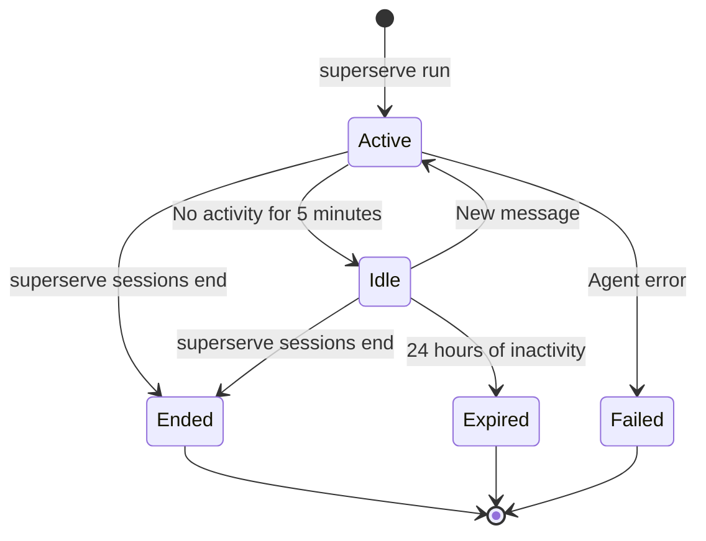

The `superserve sessions` commands manage active and past agent sessions.

Each session represents an isolated conversation with an agent, complete with persistent state in the `/workspace` filesystem.

## List Sessions

View all sessions:

```bash
superserve sessions list
```

### Example Output

```
ID            Agent        Title                   Status   Msgs  Last Active
5a3f7b9c2e1d  my-agent     What is the capital...  ACTIVE   3     2 minutes ago
8d4e6f1a3b2c  test-agent   Write a Python scri...  IDLE     1     1 hour ago
9e5f7a2b4c3d  my-agent     Debug my code           ENDED    5     2 days ago
```

### Filter by Agent

```bash
superserve sessions list --agent my-agent
```

This shows only sessions for the specified agent.

### Filter by Status

```bash
superserve sessions list --status active
```

Supported statuses:
- `active` - Session is currently running
- `running` - Alias for active
- `idle` - Session exists but no recent activity
- `completed` - Session finished successfully
- `ended` - Session was manually ended
- `failed` - Session encountered an error
- `error` - Alias for failed

### JSON Output

```bash
superserve sessions list --json
```

```json
[
  {
    "id": "ses_5a3f7b9c2e1d4f6a8b0c9d1e2f3a4b5c",
    "agent_id": "agt_abc123def456",
    "agent_name": "my-agent",
    "title": "What is the capital of France?",
    "status": "active",
    "message_count": 3,
    "created_at": "2026-03-09T10:15:00Z",
    "last_activity_at": "2026-03-09T10:17:00Z"
  }
]
```

## Get Session Details

View detailed information about a session:

```bash
superserve sessions get ses_5a3f7b9c2e1d
```

### Short Session IDs

You can use a short prefix of the session ID:

```bash
superserve sessions get 5a3f7b9c
```

The CLI matches any session starting with that prefix.

### Example Output

```
Field        Value
ID           ses_5a3f7b9c2e1d4f6a8b0c9d1e2f3a4b5c
Agent        my-agent (agt_abc123def456)
Status       ACTIVE
Messages     3
Created      2026-03-09 10:15:00 UTC
Title        What is the capital of France?
Last Active  2 minutes ago (2026-03-09 10:17:00 UTC)
```

### JSON Output

```bash
superserve sessions get ses_5a3f7b9c --json
```

## Resume Session

Continue a previous session:

```bash
superserve sessions resume ses_5a3f7b9c
```

This reconnects to the session and starts an interactive loop.

### Example

```bash
superserve sessions resume 5a3f7b9c
```

```
Resumed: "What is the capital of France?" (my-agent)

You > What about Germany?

Agent > The capital of Germany is Berlin.

Completed in 1.1s

You > exit
```

### Persistent State

When you resume a session:

- **Conversation history** - The agent remembers previous messages
- **Filesystem state** - Files in `/workspace` persist from the previous session
- **Environment** - Secrets and configuration remain available

This is useful for:
- Multi-turn debugging sessions
- Long-running data analysis tasks
- Resuming after network interruptions

## End Session

Manually end an active session:

```bash
superserve sessions end ses_5a3f7b9c
```

### Example Output

```
✓ Session 5a3f7b9c ended (status: ENDED)
```

### Why End Sessions?

Ending sessions:
- **Frees resources** - Stops the sandbox container
- **Clears state** - Resets the `/workspace` filesystem
- **Improves security** - Ensures sensitive data doesn't persist

Sessions automatically expire after 24 hours of inactivity, but you can end them manually if needed.

## Command Reference

### `superserve sessions list`

List all sessions.

<ParamField path="--agent" type="string">
  Filter sessions by agent name or ID
</ParamField>

<ParamField path="--status" type="string">
  Filter sessions by status (e.g., `active`, `idle`, `ended`)
</ParamField>

<ParamField path="--json" type="flag" default="false">
  Output as JSON
</ParamField>

### `superserve sessions get`

Get details of a specific session.

<ParamField path="session-id" type="string" required>
  Session ID or short prefix (e.g., `ses_5a3f7b9c` or `5a3f7b9c`)
</ParamField>

<ParamField path="--json" type="flag" default="false">
  Output as JSON
</ParamField>

### `superserve sessions resume`

Resume a previous session.

<ParamField path="session-id" type="string" required>
  Session ID or short prefix (e.g., `ses_5a3f7b9c` or `5a3f7b9c`)
</ParamField>

### `superserve sessions end`

End an active session.

<ParamField path="session-id" type="string" required>
  Session ID or short prefix (e.g., `ses_5a3f7b9c` or `5a3f7b9c`)
</ParamField>

## Session Lifecycle



### Status Meanings

| Status | Description |
|--------|-------------|
| `ACTIVE` | Session is currently processing a message |
| `IDLE` | Session exists but no recent activity |
| `RUNNING` | Alias for ACTIVE |
| `ENDED` | Session was manually ended |
| `COMPLETED` | Session finished successfully |
| `FAILED` | Agent encountered an error |
| `ERROR` | Alias for FAILED |
| `PENDING` | Session is being created |

## Session IDs

Session IDs are prefixed with `ses_` and contain 32 hexadecimal characters:

```
ses_5a3f7b9c2e1d4f6a8b0c9d1e2f3a4b5c
```

### Short IDs

The CLI displays shortened IDs in `sessions list` for readability:

```
5a3f7b9c2e1d
```

You can use short prefixes with all commands as long as they're unique:

```bash
superserve sessions resume 5a3f7b9c
```

## Examples

### List Recent Sessions

```bash
superserve sessions list --status active
```

### Resume Last Session for Agent

```bash
LAST_SESSION=$(superserve sessions list --agent my-agent --json | jq -r '.[0].id')
superserve sessions resume $LAST_SESSION
```

### End All Idle Sessions

```bash
superserve sessions list --status idle --json | jq -r '.[].id' | while read sid; do
  superserve sessions end $sid
done
```

### Count Messages Across All Sessions

```bash
superserve sessions list --json | jq '[.[].message_count] | add'
```

## Session Titles

Sessions are titled based on the first message:

```
What is the capital of France?
```

Titles are truncated to 50 characters in the list view.

## Troubleshooting

### "Session not found"

Verify the session ID:

```bash
superserve sessions list
```

Session IDs are case-sensitive and must match exactly (or be a unique prefix).

### "No sessions found"

You haven't started any sessions yet. Run an agent:

```bash
superserve run my-agent "Hello"
```

### "Session has expired"

Sessions expire after 24 hours of inactivity and cannot be resumed. Start a new session:

```bash
superserve run my-agent
```

## Best Practices

- **Resume for long tasks** - Use `sessions resume` for multi-step debugging or data analysis
- **End when done** - Manually end sessions to free resources
- **Filter by agent** - Use `--agent` to find sessions for specific agents
- **Check status** - Use `sessions get` to see how many messages are in a session
- **Use short IDs** - The first 8-12 characters are usually unique enough