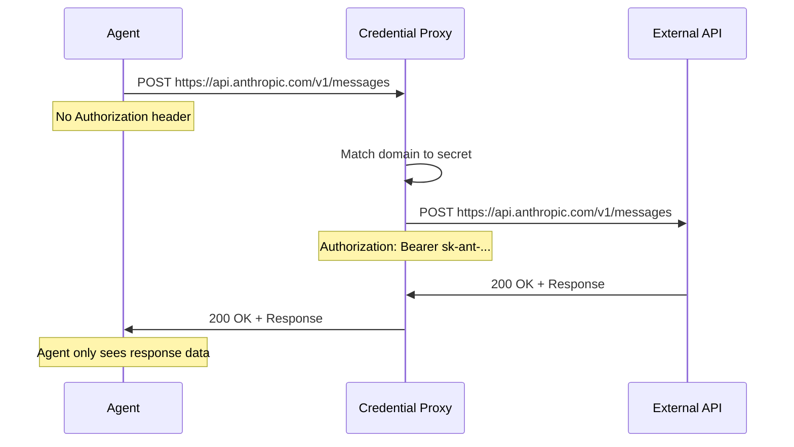

## The credential exposure problem

Agents make API calls to services like Anthropic, OpenAI, Stripe, or your own backend. Without proper credential management:

- **API keys appear in LLM context** - The model sees the key in environment variables or code, increasing the risk of accidental leakage
- **Keys leak into logs** - Tool outputs and error messages expose credentials in plaintext
- **Prompt injection attacks** - A malicious user tricks the agent into printing `os.environ["ANTHROPIC_API_KEY"]`
- **No audit trail** - You can't track which agent made which API call or revoke access per-session

Storing keys as environment variables solves distribution, but not exposure. The agent still sees the credentials.

## Superserve's credential proxy

Superserve injects API keys at the **network level**, not as environment variables. When your agent makes an HTTP request, the platform intercepts it, adds the appropriate `Authorization` header, and forwards it to the destination.

<Info>
  The agent never sees the API key. It doesn't appear in environment variables, tool outputs, or LLM context.
</Info>

### How it works



1. You set secrets with `superserve secrets set my-agent ANTHROPIC_API_KEY=sk-ant-...`
2. Superserve stores the key encrypted at rest
3. When your agent makes a request to `api.anthropic.com`, the proxy intercepts it
4. The proxy injects the `Authorization: Bearer sk-ant-...` header
5. The request reaches the API with credentials
6. The agent receives the response - no key in sight

### Supported APIs

The proxy automatically handles authentication for common services:

| Service | Environment Variable | Header Injected |
|---------|---------------------|----------------|
| Anthropic | `ANTHROPIC_API_KEY` | `x-api-key: <key>` |
| OpenAI | `OPENAI_API_KEY` | `Authorization: Bearer <key>` |
| Custom | `<NAME>_API_KEY` | Configured per secret |

<Note>
  You can configure custom header injection for any API. Contact support for advanced use cases.
</Note>

## Setting secrets

Use the `superserve secrets` command to manage credentials:

```bash
# Set one or more secrets
superserve secrets set my-agent ANTHROPIC_API_KEY=sk-ant-...

# Set multiple secrets at once
superserve secrets set my-agent \
  ANTHROPIC_API_KEY=sk-ant-... \
  OPENAI_API_KEY=sk-proj-... \
  DATABASE_URL=postgresql://...

# List secret key names (values are never shown)
superserve secrets list my-agent

# Delete a secret
superserve secrets delete my-agent ANTHROPIC_API_KEY
```

Secrets are encrypted at rest and scoped to the agent. You can't accidentally use one agent's credentials in another.

<Warning>
  Secret values are write-only. You can't retrieve a secret after setting it. Store keys in a password manager or secret vault.
</Warning>

## Environment variables for non-API secrets

Some credentials aren't API keys sent in HTTP headers: database URLs, signing secrets, or configuration tokens. For these, Superserve injects them as **environment variables** inside the sandbox:

```python
import os

# This is injected as an environment variable
database_url = os.environ["DATABASE_URL"]
```

The difference:
- **API keys** (e.g., `ANTHROPIC_API_KEY`, `OPENAI_API_KEY`) are intercepted at the network level
- **Non-API secrets** (e.g., `DATABASE_URL`, `JWT_SECRET`) are injected as environment variables

<Tip>
  Use the `secrets` field in `superserve.yaml` to declare which environment variables your agent needs:

  ```yaml superserve.yaml
  name: my-agent
  secrets:
    - ANTHROPIC_API_KEY
    - DATABASE_URL
    - STRIPE_SECRET_KEY
  ```

  This serves as documentation and reminds you to set them after deployment.
</Tip>

## What the agent sees

Let's see exactly what's visible inside the agent:

```python
import os
import requests

# Environment variables
print(os.environ.get("ANTHROPIC_API_KEY"))  # None - not exposed
print(os.environ.get("DATABASE_URL"))       # postgresql://... - injected

# HTTP request WITHOUT credentials
response = requests.post(
    "https://api.anthropic.com/v1/messages",
    json={
        "model": "claude-sonnet-4-20250514",
        "max_tokens": 1024,
        "messages": [{"role": "user", "content": "Hello"}]
    }
)

# The proxy added the Authorization header
# The agent only sees the response
print(response.json())
# {"content": [{"type": "text", "text": "Hello! How can I help..."}], ...}
```

The agent makes the request as if it's unauthenticated. The proxy handles authentication transparently.

## SDK usage

Most agent SDKs automatically use environment variables for API keys. Since Superserve intercepts network requests, the SDK works without changes:

<CodeGroup>

```python Claude Agent SDK
from claude_agent_sdk import ClaudeAgentOptions, ClaudeSDKClient

# No API key needed in code - the proxy handles it
options = ClaudeAgentOptions(
    model="sonnet",
    system_prompt="You are a helpful assistant.",
)

async with ClaudeSDKClient(options=options) as client:
    await client.query(prompt="Hello", session_id="chat")
    async for msg in client.receive_response():
        print(msg)
```

```typescript OpenAI SDK
import OpenAI from "openai"

// No API key in code - the proxy injects it
const openai = new OpenAI()

const completion = await openai.chat.completions.create({
  model: "gpt-4",
  messages: [{ role: "user", content: "Hello" }],
})

console.log(completion.choices[0].message.content)
```

</CodeGroup>

The SDKs make HTTP requests to the API, and Superserve's proxy adds the credentials.

## Security guarantees

<AccordionGroup>
  <Accordion title="API keys never appear in LLM context">
    The model doesn't see the key in environment variables, code, or tool outputs. It can't accidentally leak them in responses.

    ```python
    # Even if the agent tries to read the key...
    import os
    print(os.environ.get("ANTHROPIC_API_KEY"))  # None

    # The proxy still injects it at the network level
    response = requests.post("https://api.anthropic.com/v1/messages", ...)
    # Works! But the agent never saw the key
    ```
  </Accordion>

  <Accordion title="Keys don't leak into logs">
    Tool outputs, error messages, and debug logs don't contain credentials:

    ```python
    # This would normally print the full Authorization header
    response = requests.get("https://api.anthropic.com/v1/messages")
    print(response.request.headers)  # No Authorization header visible

    # The agent only sees: {"User-Agent": "python-requests/2.28.0", ...}
    # The proxy added the header after interception
    ```
  </Accordion>

  <Accordion title="Per-agent credential scoping">
    Each agent has its own set of secrets. You can't accidentally use Agent A's API key in Agent B.

    ```bash
    # Set different keys for different agents
    superserve secrets set agent-a ANTHROPIC_API_KEY=sk-ant-alice...
    superserve secrets set agent-b ANTHROPIC_API_KEY=sk-ant-bob...
    ```

    Sessions for `agent-a` will only see `alice`'s key injected. Sessions for `agent-b` will only see `bob`'s key.
  </Accordion>

  <Accordion title="Revocation and rotation">
    Change or revoke credentials without redeploying your agent:

    ```bash
    # Rotate a key
    superserve secrets set my-agent ANTHROPIC_API_KEY=sk-ant-new-key...

    # All new sessions immediately use the new key
    # Active sessions continue using the old key until they restart
    ```

    This is faster and safer than redeploying with a new environment variable.
  </Accordion>

  <Accordion title="Audit trail">
    Every HTTP request the agent makes is logged with:
    - Destination URL
    - Request method and headers (except credentials)
    - Response status and size
    - Session and agent ID

    You get a full audit trail of which agent made which API call, without exposing the credentials themselves.
  </Accordion>
</AccordionGroup>

## Limitations and edge cases

<Warning>
  The credential proxy works for HTTP/HTTPS requests. It doesn't inject credentials into non-HTTP protocols like database connections or SSH.
</Warning>

### Non-HTTP secrets

For credentials that aren't HTTP API keys (e.g., database URLs, SSH keys), use environment variables:

```python
import os
from sqlalchemy import create_engine

# DATABASE_URL is injected as an environment variable
engine = create_engine(os.environ["DATABASE_URL"])
```

The environment variable **is** visible to the agent. If your threat model requires hiding database credentials from the LLM context, use a connection proxy or secret manager that your agent calls via HTTP.

### Custom authentication schemes

Some APIs use non-standard authentication (HMAC signatures, custom headers, OAuth flows). The proxy supports custom configuration:

```bash
# Contact support for advanced auth schemes
superserve secrets set my-agent \
  CUSTOM_API_SECRET=abc123 \
  --header "X-Custom-Auth: {CUSTOM_API_SECRET}"
```

### Framework-specific considerations

Some frameworks cache API clients at import time. Ensure your agent creates clients **after** the proxy is initialized:

```python
# Bad - client created at import time (before proxy is ready)
from anthropic import Anthropic
client = Anthropic()  # Might fail or miss proxy

def run_agent():
    client.messages.create(...)

# Good - client created when agent runs
from anthropic import Anthropic

def run_agent():
    client = Anthropic()  # Proxy is ready
    client.messages.create(...)
```

---

<CardGroup cols={2}>
  <Card title="Isolation" icon="shield-halved" href="/concepts/isolation">
    How sessions are isolated at the VM level
  </Card>
  <Card title="Deployment" icon="wand-magic-sparkles" href="/cli/deploy">
    Setting secrets during and after deployment
  </Card>
  <Card title="CLI Reference" icon="terminal" href="/cli/installation">
    All `superserve secrets` commands
  </Card>
  <Card title="Quickstart" icon="bolt" href="/quickstart">
    End-to-end example with secrets
  </Card>
</CardGroup>
