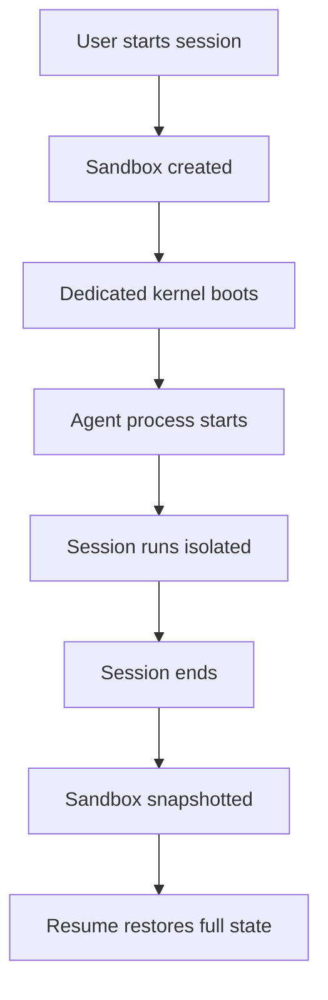

## Why isolation matters

Agents execute arbitrary code, install packages, read files, and make HTTP requests. Without proper isolation, one session can:

- Access credentials or data from another user's session
- Consume resources that starve other agents
- Leave behind state that affects the next session
- Compromise the host system or other workloads

Traditional containers share a kernel. If an agent finds a kernel exploit, it can escape and access other containers on the same host. For production AI agents handling sensitive data and credentials, that's not acceptable.

## Sandboxed environments

Superserve runs every session in its own isolated sandbox with a dedicated kernel, filesystem, and network stack.

<CardGroup cols={2}>
  <Card title="Dedicated kernel" icon="server">
    Each session gets its own Linux kernel. Kernel exploits are contained to that single sandbox.
  </Card>
  <Card title="Full root access" icon="user-crown">
    The agent can install packages, modify system files, and execute any code. Nothing it does can touch other sessions.
  </Card>
  <Card title="Resource limits" icon="gauge-high">
    CPU, memory, and disk are allocated per-session. One agent can't starve another.
  </Card>
  <Card title="Sub-second starts" icon="bolt">
    Pre-provisioned sandboxes mean your agent starts almost instantly, not in minutes.
  </Card>
</CardGroup>

### How it works



When you run `superserve run my-agent`, Superserve:

1. Creates a new isolated sandbox (or restores a snapshot if resuming)
2. Injects credentials via the credential proxy
3. Starts your agent process inside the sandbox
4. Routes all I/O through the streaming API

When the session goes idle, the sandbox is snapshotted. When resumed, the full state is restored: filesystem, packages, processes, and environment variables.

## What's isolated

<AccordionGroup>
  <Accordion title="Filesystem">
    Each session starts with a clean root filesystem. Your agent can create files, install packages, modify `/etc/hosts`, or rewrite system configs - none of it affects other sessions.

    The entire sandbox is snapshotted when the session goes idle, so all filesystem changes persist when resumed. Different sessions (even for the same agent) have completely separate filesystems.

    ```bash
    # Inside one session
    $ echo "malicious" > /etc/passwd
    $ cat /etc/passwd
    malicious

    # Inside another session (even for the same agent)
    $ cat /etc/passwd
    root:x:0:0:root:/root:/bin/bash
    ...
    ```
  </Accordion>

  <Accordion title="Network">
    Each sandbox has its own network namespace. The agent can bind to any port, make outbound requests, or run servers - none of it is visible to other sessions.

    All outbound HTTP requests route through Superserve's managed proxy, which:
    - Injects API keys from secrets (see [Credentials](/concepts/credentials))
    - Logs every request for the audit trail

    ```python
    # This works - every session has its own network stack
    import http.server
    server = http.server.HTTPServer(('0.0.0.0', 8080), handler)
    server.serve_forever()
    ```
  </Accordion>

  <Accordion title="Process tree">
    Your agent runs as PID 1 inside the sandbox. It can spawn child processes, fork, exec, or use multiprocessing without interfering with other sessions.

    ```python
    import subprocess
    # This installs a package inside this session only
    subprocess.run(["pip", "install", "requests"])
    ```

    When resuming the same session, `requests` will still be installed. A different session won't have it unless it's in your `requirements.txt`.
  </Accordion>

  <Accordion title="Memory and CPU">
    Each session gets allocated CPU and memory limits. One agent can't consume resources and starve others.

    If your agent hits a memory limit or runs an infinite loop, it only affects that session. Other sessions continue running normally.
  </Accordion>
</AccordionGroup>

## Isolation vs. persistence

Superserve combines two goals:

1. **Isolation** - Every session is fully isolated from every other session
2. **Persistence** - Sessions preserve their entire state across turns and restarts

When you resume a session, the platform restores the **full sandbox snapshot**: filesystem, installed packages, running processes, and environment variables. You pick up exactly where you left off.

Isolation applies **between sessions**, not within a session. Two sessions for the same agent run in completely separate sandboxes with no shared state. See [Persistence](/concepts/persistence) for details.

## Security model

<Note>
  Superserve's isolation is designed for multi-tenant production environments where sessions from different users run on shared infrastructure.
</Note>

### What isolation prevents

- **Cross-session access**: One session cannot read files, memory, or network traffic from another session
- **Host access**: The agent cannot escape the sandbox and access the host OS or other workloads
- **Resource exhaustion**: CPU and memory limits prevent one session from affecting others

### What you still need to handle

- **Input validation**: Your agent should validate and sanitize user input before executing code or making API calls
- **Prompt injection**: The isolation doesn't protect against prompt attacks - use a robust system prompt and framework best practices
- **External API security**: If your agent calls external APIs, ensure those APIs have proper authentication and authorization

## Isolation in the SDK

Every `run()` or `stream()` call creates a new isolated session unless you explicitly pass a `sessionId`:

```typescript
import Superserve from "@superserve/sdk"

const client = new Superserve({ apiKey: "your-api-key" })

// Each of these runs in its own isolated sandbox
const r1 = await client.run("my-agent", { message: "Hello" })
const r2 = await client.run("my-agent", { message: "Hello" })

// These run in the SAME sandbox (same session)
const session = await client.createSession("my-agent")
const s1 = await session.run("Hello")
const s2 = await session.run("What did I just say?") // Agent remembers
```

See [Sessions](/concepts/sessions) for session lifecycle details.

## Performance

Superserve sandboxes are designed for high-density, multi-tenant workloads:

- **Stateful scale-to-zero**: Idle sandboxes are snapshotted and suspended, consuming zero compute. You only pay for active sessions.
- **Millisecond resume**: Snapshots restore the full environment (files, packages, processes) in milliseconds, not minutes.
- **Low overhead**: Minimal memory overhead per sandbox.

For most agents, the isolation and snapshot overhead is imperceptible compared to LLM inference time.

---

<CardGroup cols={2}>
  <Card title="Persistence" icon="hard-drive" href="/concepts/persistence">
    How sandbox state persists across sessions
  </Card>
  <Card title="Credentials" icon="lock" href="/concepts/credentials">
    How secrets are injected without exposing them
  </Card>
  <Card title="Sessions" icon="messages" href="/concepts/sessions">
    Multi-turn conversations and session lifecycle
  </Card>
  <Card title="Deploy" icon="wand-magic-sparkles" href="/cli/deploy">
    How your code runs inside the sandbox
  </Card>
</CardGroup>
