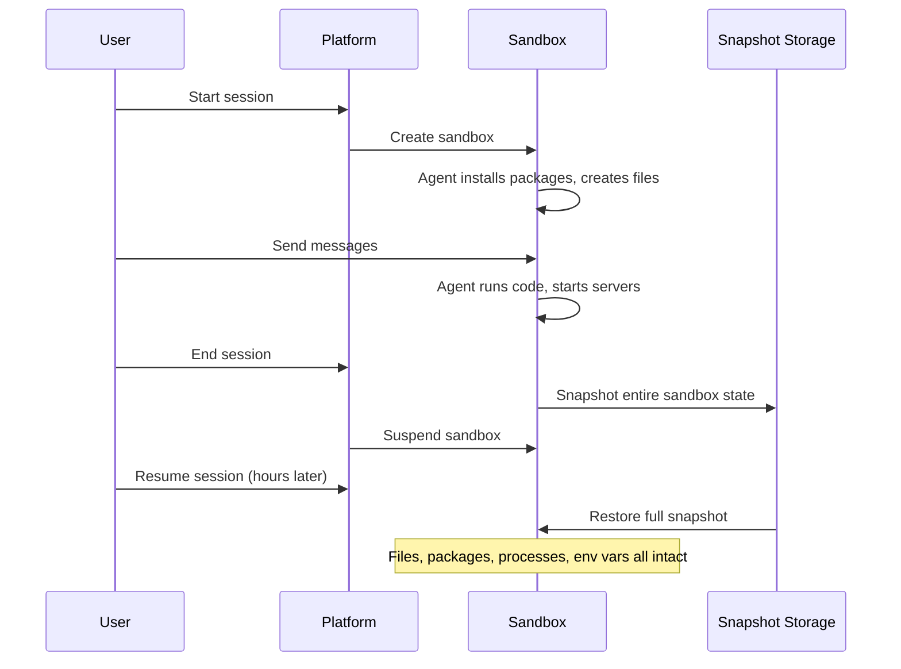

## Why persistence matters

Agents need to remember context across conversations:

- A code review agent writes notes to `findings.md` and references them in later turns
- A research agent saves scraped data to CSV files and analyzes it over multiple messages
- A dev agent clones a repo, installs dependencies, makes changes, and iterates based on results

Without persistence, every turn starts from scratch. The agent forgets what it did, loses files it created, and can't build on previous work.

## Full sandbox snapshots

Superserve snapshots and restores the **entire sandbox state** when resuming sessions. This includes:

- **The full filesystem**, not just `/workspace`
- **Installed packages** (pip, npm, apt, etc.)
- **Environment variables** set at runtime
- **Running processes**, background jobs, and servers
- **System-level changes** (modified `/etc/hosts`, custom configs, etc.)

When you resume a session, you pick up exactly where you left off. The sandbox is restored to the precise state it was in when the session was last active.

<Info>
  The `/workspace` directory is where your agent code is deployed and where agents typically read and write files. But persistence is not limited to `/workspace`. The entire sandbox is snapshotted and restored.
</Info>

### How it works



When you start or resume a session:

1. Superserve creates an isolated sandbox (see [Isolation](/concepts/isolation))
2. If resuming, the platform restores the full snapshot from the previous session
3. Your agent sees everything exactly as it left it: files, packages, running processes, environment variables
4. When the session ends, the entire sandbox state is snapshotted for later resumption

## What persists

<AccordionGroup>
  <Accordion title="Files and the full filesystem">
    Any file the agent writes, anywhere in the filesystem, is preserved:

    ```python
    # Turn 1
    with open("/workspace/notes.txt", "w") as f:
        f.write("First observation")

    # Turn 2 (same session, or resumed days later)
    with open("/workspace/notes.txt", "r") as f:
        print(f.read())  # "First observation"
    ```

    This includes:
    - Text files, CSVs, JSON, databases
    - Git repositories cloned or modified by the agent
    - Build artifacts, test results, logs
    - Files written outside `/workspace` (e.g. `/tmp`, `/home`, `/etc`)
  </Accordion>

  <Accordion title="Installed packages">
    Packages installed at runtime are preserved across turns and session resumptions:

    ```python
    # Turn 1
    import subprocess
    subprocess.run(["pip", "install", "requests"])
    import requests  # Works

    # Turn 2 (resumed later)
    import requests  # Still works
    ```

    The same applies to system packages, Node modules, and anything else installed during the session. You can still declare dependencies in `requirements.txt` or `pyproject.toml` for initial deployment, but runtime installations are not lost.
  </Accordion>

  <Accordion title="Environment variables">
    Environment variables set by your agent persist across turns:

    ```python
    # Turn 1
    os.environ["MY_VAR"] = "value"

    # Turn 2
    os.environ.get("MY_VAR")  # "value"
    ```

    For secrets that should be set before the agent starts, use `superserve secrets set` (see [Credentials](/concepts/credentials)).
  </Accordion>

  <Accordion title="Process state and background jobs">
    Running processes, background jobs, and servers survive across turns:

    ```python
    # Turn 1: Start a background server
    import subprocess
    subprocess.Popen(["python", "-m", "http.server", "8000"])

    # Turn 2: The server is still running
    import requests
    requests.get("http://localhost:8000")  # Works
    ```

    The sandbox snapshot captures the full process state, so background jobs continue running when the session resumes.
  </Accordion>

  <Accordion title="System-level changes">
    Modifications to system files are preserved:

    ```bash
    # During a session
    echo "127.0.0.1 myapp.local" >> /etc/hosts

    # Resumed later: /etc/hosts still has your changes
    ```

    This includes changes to system configs, custom scripts in `/usr/local/bin`, and any other system-level modifications.
  </Accordion>

  <Accordion title="Project files from deployment">
    When you `superserve deploy`, your entire project directory (minus ignored files) is uploaded and extracted into `/workspace`.

    ```bash
    research-agent/
    ├── agent.py
    ├── prompts/
    │   └── system.txt
    └── pyproject.toml
    ```

    Inside the sandbox:

    ```bash
    /workspace/
    ├── agent.py
    ├── prompts/
    │   └── system.txt
    └── pyproject.toml
    ```

    Your agent can read these files using relative paths:

    ```python
    with open("prompts/system.txt") as f:
        system_prompt = f.read()
    ```

    If the agent modifies these files during a session, the changes persist.
  </Accordion>

  <Accordion title="Conversation history (framework-dependent)">
    Most agent frameworks store conversation history in memory or on disk. Since process state persists, in-memory conversation history is retained across turns.

    **Claude Agent SDK:**
    ```python
    # Use continue_conversation to maintain context across turns
    options = ClaudeAgentOptions(
        model="sonnet",
        continue_conversation=True,  # Enables conversation memory
    )
    ```

    For long-term persistence, you can also write conversation state to disk:

    ```python
    import json

    HISTORY_FILE = "/workspace/conversation.json"

    def save_history(messages):
        with open(HISTORY_FILE, "w") as f:
            json.dump(messages, f)

    def load_history():
        if os.path.exists(HISTORY_FILE):
            with open(HISTORY_FILE) as f:
                return json.load(f)
        return []
    ```
  </Accordion>
</AccordionGroup>

## Session-specific sandboxes

Each session has its own sandbox. If you start two different sessions for the same agent, they get separate environments:

```typescript
import Superserve from "@superserve/sdk"

const client = new Superserve({ apiKey: "your-api-key" })

const session1 = await client.createSession("my-agent")
const session2 = await client.createSession("my-agent")

// These run in DIFFERENT sandboxes with separate state
await session1.run("Create a file called data.txt")
await session2.run("Create a file called data.txt")
```

Each session has its own isolated sandbox. Sessions don't share state.

## Managing storage size

The sandbox has a storage limit per session. If your agent generates large files, clean them up when no longer needed:

```python
import os

# Clean up old files
for filename in os.listdir("/workspace/temp"):
    filepath = os.path.join("/workspace/temp", filename)
    os.remove(filepath)
```

<Tip>
  Use `.gitignore`-style patterns in `superserve.yaml` to avoid uploading large files during deployment:

  ```yaml
  ignore:
    - data/large-dataset.csv
    - "*.mp4"
    - node_modules/
  ```
</Tip>

## Persistence in practice

### Example: Code review agent

```python
import os

FINDINGS_FILE = "/workspace/review_findings.md"

def save_finding(issue):
    with open(FINDINGS_FILE, "a") as f:
        f.write(f"- {issue}\n")

def get_all_findings():
    if not os.path.exists(FINDINGS_FILE):
        return []
    with open(FINDINGS_FILE) as f:
        return f.readlines()

# Turn 1: Agent finds issues
save_finding("Missing error handling in auth.py:42")
save_finding("Hardcoded API key in config.py:18")

# Turn 2: User asks for a summary
findings = get_all_findings()
print(f"Found {len(findings)} issues across the review.")
```

The findings persist across turns and days. Resume the session a week later, and the file is still there.

### Example: Multi-step research agent

```python
import json

RESEARCH_STATE = "/workspace/research_state.json"

def save_state(data):
    with open(RESEARCH_STATE, "w") as f:
        json.dump(data, f)

def load_state():
    if os.path.exists(RESEARCH_STATE):
        with open(RESEARCH_STATE) as f:
            return json.load(f)
    return {"stage": "initial", "sources": [], "findings": []}

# Turn 1: Gather sources
state = load_state()
state["sources"].append("https://example.com/article")
state["stage"] = "gathering"
save_state(state)

# Turn 2: Analyze sources
state = load_state()
for source in state["sources"]:
    # Process each source
    state["findings"].append(f"Key insight from {source}")
state["stage"] = "analyzing"
save_state(state)

# Turn 3: Generate report
state = load_state()
if state["stage"] == "analyzing":
    with open("/workspace/report.md", "w") as f:
        f.write("# Research Report\n\n")
        for finding in state["findings"]:
            f.write(f"- {finding}\n")
```

The agent builds up state over multiple turns, knowing that the full sandbox environment is preserved.

---

<CardGroup cols={2}>
  <Card title="Isolation" icon="shield-halved" href="/concepts/isolation">
    How sessions run in isolated sandboxes
  </Card>
  <Card title="Sessions" icon="messages" href="/concepts/sessions">
    Multi-turn conversations and resuming
  </Card>
  <Card title="Deployment" icon="wand-magic-sparkles" href="/cli/deploy">
    How project files are packaged into /workspace
  </Card>
  <Card title="CLI Reference" icon="terminal" href="/cli/installation">
    Commands for managing sessions
  </Card>
</CardGroup>
