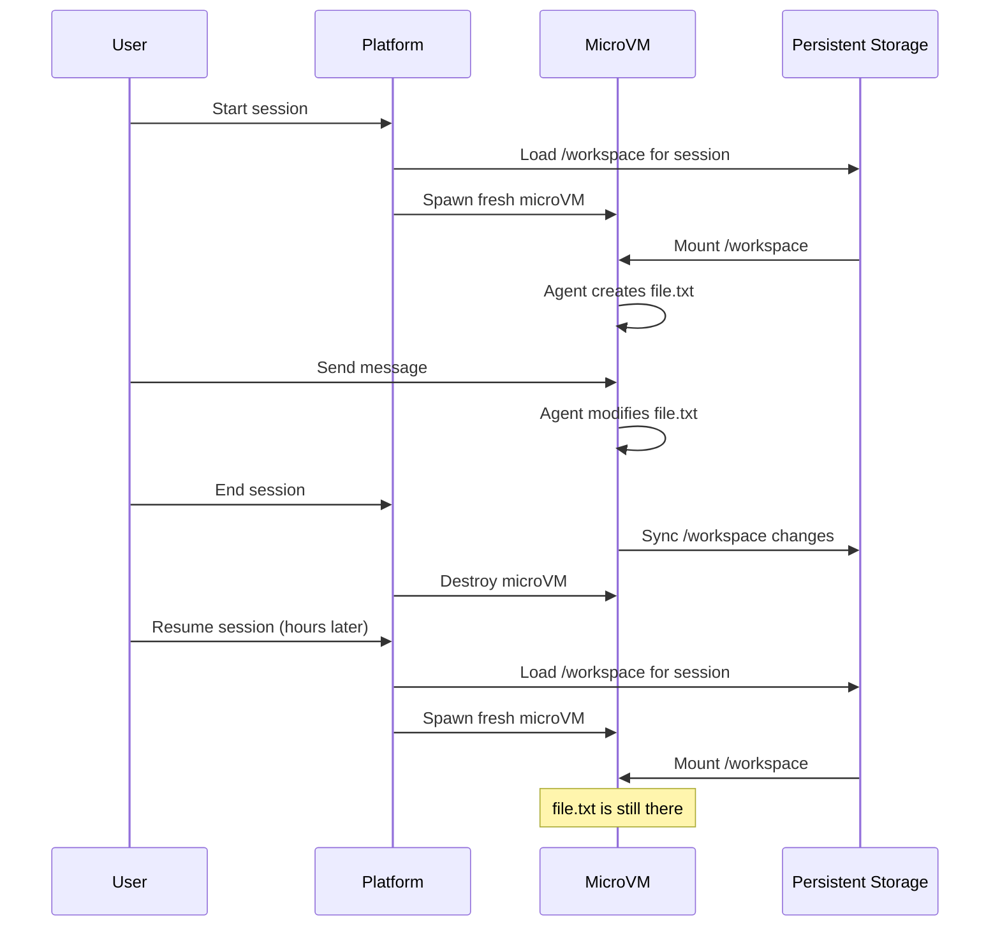

## Why persistence matters

Agents need to remember context across conversations:

- A code review agent writes notes to `findings.md` and references them in later turns
- A research agent saves scraped data to CSV files and analyzes it over multiple messages
- A dev agent clones a repo, makes changes, tests them, and iterates based on results

Without persistence, every turn starts from scratch. The agent forgets what it did, loses files it created, and can't build on previous work.

## The `/workspace` filesystem

Superserve persists the `/workspace` directory across:

- **Turns**: Each message in a conversation
- **Restarts**: If the agent crashes or times out
- **Sessions**: Resume a conversation days later with every file intact

<Info>
  Only `/workspace` persists. Everything else - system files, installed packages, process state - is ephemeral and resets when the session ends.
</Info>

### How it works



When you start or resume a session:

1. Superserve spawns a fresh Firecracker microVM (see [Isolation](/concepts/isolation))
2. The platform mounts the `/workspace` filesystem specific to that session
3. Your agent sees all files from previous turns exactly as it left them
4. When the session ends, changes are synced back to persistent storage

## What persists

<AccordionGroup>
  <Accordion title="Files created by the agent">
    Any file the agent writes to `/workspace` is saved:

    ```python
    # Turn 1
    with open("/workspace/notes.txt", "w") as f:
        f.write("First observation")

    # Turn 2 (same session, or resumed days later)
    with open("/workspace/notes.txt", "r") as f:
        print(f.read())  # "First observation"
    ```

    This includes:
    - Text files, CSVs, JSON, databases
    - Git repositories cloned or modified by the agent
    - Build artifacts, test results, logs
    - Any output from tools the agent runs
  </Accordion>

  <Accordion title="Project files from deployment">
    When you `superserve deploy`, your entire project directory (minus ignored files) is uploaded and extracted into `/workspace`.

    ```bash
    research-agent/
    ├── agent.py
    ├── prompts/
    │   └── system.txt
    └── pyproject.toml
    ```

    Inside the microVM:

    ```bash
    /workspace/
    ├── agent.py
    ├── prompts/
    │   └── system.txt
    └── pyproject.toml
    ```

    Your agent can read these files using relative paths:

    ```python
    with open("prompts/system.txt") as f:
        system_prompt = f.read()
    ```

    If the agent modifies these files during a session, the changes persist.
  </Accordion>

  <Accordion title="Conversation history (framework-dependent)">
    Most agent frameworks store conversation history in memory or on disk. If your framework supports persistent conversations, combine it with `/workspace` for full context retention.

    **Claude Agent SDK:**
    ```python
    # Use continue_conversation to maintain context across turns
    options = ClaudeAgentOptions(
        model="sonnet",
        continue_conversation=True,  # Enables conversation memory
    )
    ```

    The SDK keeps the conversation in memory during the session. When you resume later, the framework might not have the full history unless you explicitly persist it to `/workspace`.

    **Best practice:** Store conversation state in `/workspace` if you need it to survive VM restarts:

    ```python
    import json

    HISTORY_FILE = "/workspace/conversation.json"

    def save_history(messages):
        with open(HISTORY_FILE, "w") as f:
            json.dump(messages, f)

    def load_history():
        if os.path.exists(HISTORY_FILE):
            with open(HISTORY_FILE) as f:
                return json.load(f)
        return []
    ```
  </Accordion>
</AccordionGroup>

## What doesn't persist

<Warning>
  Everything outside `/workspace` is ephemeral and resets when the session ends.
</Warning>

<AccordionGroup>
  <Accordion title="Installed packages">
    If your agent installs a package at runtime, it won't be available in the next session:

    ```python
    # Inside a session
    import subprocess
    subprocess.run(["pip", "install", "requests"])
    import requests  # Works

    # Next session or turn (after VM restart)
    import requests  # ModuleNotFoundError
    ```

    **Solution:** Add dependencies to `requirements.txt` or `pyproject.toml` so they're installed during deployment.

    ```txt requirements.txt
    requests
    beautifulsoup4
    ```
  </Accordion>

  <Accordion title="Environment variables set at runtime">
    Environment variables your agent sets don't persist:

    ```python
    # Turn 1
    os.environ["MY_VAR"] = "value"

    # Turn 2 (after VM restart)
    os.environ.get("MY_VAR")  # None
    ```

    **Solution:** Set secrets via `superserve secrets set` (see [Credentials](/concepts/credentials)) or write to a file in `/workspace`:

    ```python
    # Write to workspace
    with open("/workspace/.env", "w") as f:
        f.write("MY_VAR=value\n")

    # Read on next turn
    from dotenv import load_dotenv
    load_dotenv("/workspace/.env")
    ```
  </Accordion>

  <Accordion title="Process state">
    Running processes, background jobs, and in-memory state don't survive:

    ```python
    # Turn 1: Start a background server
    import subprocess
    subprocess.Popen(["python", "-m", "http.server", "8000"])

    # Turn 2: The server is gone
    # The microVM was destroyed and recreated
    ```

    **Solution:** If you need a persistent background process, start it in your agent's main loop or use a process manager that restarts on boot.
  </Accordion>

  <Accordion title="System-level changes">
    Modifications to system files outside `/workspace` don't persist:

    ```bash
    # Inside a session
    echo "127.0.0.1 myapp.local" >> /etc/hosts

    # Next session: /etc/hosts is back to default
    ```

    Each session gets a fresh root filesystem. Only `/workspace` survives.
  </Accordion>
</AccordionGroup>

## Session-specific workspaces

Each session has its own `/workspace` directory. If you start two different sessions for the same agent, they get separate workspaces:

```typescript
import Superserve from "@superserve/sdk"

const client = new Superserve({ apiKey: "your-api-key" })

const session1 = await client.createSession("my-agent")
const session2 = await client.createSession("my-agent")

// These write to DIFFERENT /workspace directories
await session1.run("Create a file called data.txt")
await session2.run("Create a file called data.txt")
```

Each session has its own isolated `/workspace` directory. Sessions don't share state.

## Managing workspace size

The `/workspace` directory has a storage limit per session. If your agent generates large files, clean them up when no longer needed:

```python
import os

# Clean up old files
for filename in os.listdir("/workspace/temp"):
    filepath = os.path.join("/workspace/temp", filename)
    os.remove(filepath)
```

<Tip>
  Use `.gitignore`-style patterns in `superserve.yaml` to avoid uploading large files during deployment:

  ```yaml
  ignore:
    - data/large-dataset.csv
    - "*.mp4"
    - node_modules/
  ```
</Tip>

## Persistence in practice

### Example: Code review agent

```python
import os

FINDINGS_FILE = "/workspace/review_findings.md"

def save_finding(issue):
    with open(FINDINGS_FILE, "a") as f:
        f.write(f"- {issue}\n")

def get_all_findings():
    if not os.path.exists(FINDINGS_FILE):
        return []
    with open(FINDINGS_FILE) as f:
        return f.readlines()

# Turn 1: Agent finds issues
save_finding("Missing error handling in auth.py:42")
save_finding("Hardcoded API key in config.py:18")

# Turn 2: User asks for a summary
findings = get_all_findings()
print(f"Found {len(findings)} issues across the review.")
```

The findings persist across turns and days. Resume the session a week later, and the file is still there.

### Example: Multi-step research agent

```python
import json

RESEARCH_STATE = "/workspace/research_state.json"

def save_state(data):
    with open(RESEARCH_STATE, "w") as f:
        json.dump(data, f)

def load_state():
    if os.path.exists(RESEARCH_STATE):
        with open(RESEARCH_STATE) as f:
            return json.load(f)
    return {"stage": "initial", "sources": [], "findings": []}

# Turn 1: Gather sources
state = load_state()
state["sources"].append("https://example.com/article")
state["stage"] = "gathering"
save_state(state)

# Turn 2: Analyze sources
state = load_state()
for source in state["sources"]:
    # Process each source
    state["findings"].append(f"Key insight from {source}")
state["stage"] = "analyzing"
save_state(state)

# Turn 3: Generate report
state = load_state()
if state["stage"] == "analyzing":
    with open("/workspace/report.md", "w") as f:
        f.write("# Research Report\n\n")
        for finding in state["findings"]:
            f.write(f"- {finding}\n")
```

The agent builds up state over multiple turns, knowing that `/workspace` will retain everything.

---

<CardGroup cols={2}>
  <Card title="Isolation" icon="shield-halved" href="/concepts/isolation">
    Why sessions get fresh microVMs each time
  </Card>
  <Card title="Sessions" icon="messages" href="/concepts/sessions">
    Multi-turn conversations and resuming
  </Card>
  <Card title="Deployment" icon="wand-magic-sparkles" href="/cli/deploy">
    How project files are packaged into /workspace
  </Card>
  <Card title="CLI Reference" icon="terminal" href="/cli/installation">
    Commands for managing sessions
  </Card>
</CardGroup>
