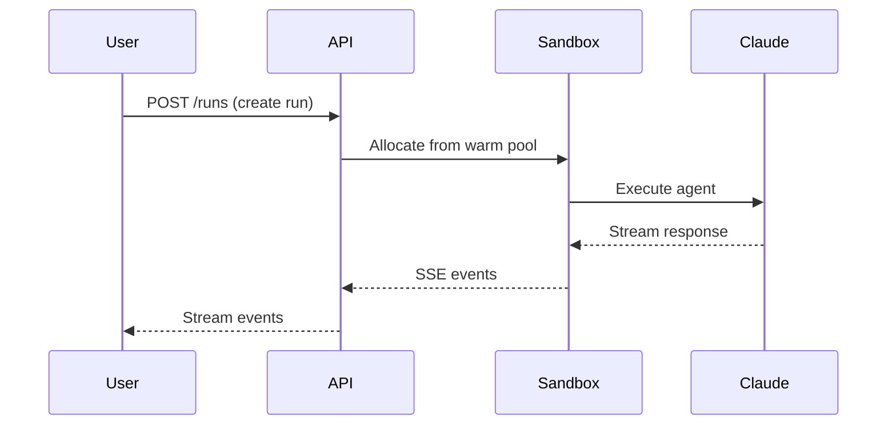

# Hosted Agents

Superserve Hosted Agents lets you deploy Claude AI agents to production in minutes, not weeks.

## What are Hosted Agents?

Hosted Agents is a managed service that handles all the infrastructure complexity of running AI agents:

- **Secure Execution**: Agents run in isolated gVisor sandboxes
- **Real-time Streaming**: Get live output via Server-Sent Events (SSE)
- **Automatic Scaling**: Warm pools ensure sub-second startup times
- **Usage Tracking**: Monitor tokens, turns, and costs automatically
- **Simple API**: RESTful API with streaming support

## How It Works



## Key Features

<CardGroup cols={2}>
  <Card title="Agent Management" icon="robot">
    Create, configure, and manage agent definitions via API or CLI
  </Card>
  <Card title="Secure Sandboxing" icon="shield">
    gVisor isolation prevents agents from accessing unauthorized resources
  </Card>
  <Card title="Real-time Streaming" icon="bolt">
    See agent output as it's generated via SSE
  </Card>
  <Card title="Multi-turn Sessions" icon="comments">
    Maintain conversation context across multiple runs
  </Card>
</CardGroup>

## Quick Example

```bash
# Create an agent
superserve agents create --name researcher \
  --system-prompt "You are a helpful research assistant" \
  --tools Bash,Read,Write,WebSearch

# Run the agent
superserve run researcher "Find the latest news about AI agents"
```

## Next Steps

<CardGroup cols={2}>
  <Card title="Quickstart" icon="rocket" href="/hosted-agents/quickstart">
    Get started in 5 minutes
  </Card>
  <Card title="API Reference" icon="code" href="/hosted-agents/api-reference">
    Full API documentation
  </Card>
</CardGroup>
