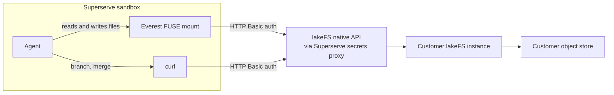

[lakeFS](https://lakefs.io/) provides Git-like branches, commits, and merges
for data stored in an object store. Mount a repository (or a ref and prefix
within one) as a filesystem so agents can read and write it with ordinary
file tools, then commit or merge through lakeFS's REST API.



With `--presign=false` (see step 3), both metadata and object data flow
through the lakeFS server, so everything leaving the sandbox passes through
Superserve's secrets proxy.

lakeFS is bring-your-own: you provide the instance, repository, and access
policy. Superserve does not provision or operate lakeFS.

<Note>
Everest is proprietary software that requires **lakeFS Cloud or Enterprise**.
Obtain the binary, or an authorized download URL for it, from lakeFS. The
binary can be downloaded and installed without authenticating to the lakeFS
API, but that alone grants no data access. A usable mount still requires a
Cloud or Enterprise deployment, valid lakeFS credentials, and sufficient
repository permissions.
</Note>

| Input or check | What it controls |
| --- | --- |
| Everest URL and SHA-256 | Downloads and verifies the binary. Success does not authenticate to lakeFS. |
| lakeFS endpoint and key pair | Authenticates Everest and REST API requests. Invalid credentials prevent a usable mount. |
| lakeFS RBAC policy | Authorizes repository reads, writes, commits, and branch operations. |
| Cloud or Enterprise deployment | Makes the Mount feature available on the target lakeFS server. |

## 1. Add Everest to a template

Fetch Everest from the download URL and verify it against the
checksum they published for that artifact — pin both rather than trusting the
download:

<CodeGroup>
```typescript TypeScript
import { Template } from "@superserve/sdk"

// Supplied by you, from lakeFS -- not distributed with this guide.
const everestUrl = process.env.EVEREST_DOWNLOAD_URL!
const everestSha256 = process.env.EVEREST_SHA256!

const template = await Template.create({
  name: "lakefs-everest-base",
  from: "ubuntu:24.04",
  steps: [
    {
      run: "apt-get update && apt-get install -y ca-certificates curl python3 util-linux fuse3",
    },
    {
      run:
        `curl -sfL -o /tmp/everest.tar.gz '${everestUrl}' && ` +
        `echo '${everestSha256}  /tmp/everest.tar.gz' | sha256sum -c - && ` +
        "tar xzf /tmp/everest.tar.gz -C /usr/local/bin everest && chmod +x /usr/local/bin/everest",
    },
  ],
})

await template.waitUntilReady()
```

```python Python
import os
import shlex

from superserve import Template, RunStep

# Supplied by you, from lakeFS -- not distributed with this guide.
everest_url = os.environ["EVEREST_DOWNLOAD_URL"]
everest_sha256 = os.environ["EVEREST_SHA256"]

template = Template.create(
    name="lakefs-everest-base",
    from_="ubuntu:24.04",
    steps=[
        RunStep(
            run="apt-get update && apt-get install -y ca-certificates curl python3 util-linux fuse3"
        ),
        RunStep(
            run=f"curl -sfL -o /tmp/everest.tar.gz {shlex.quote(everest_url)} && "
            f"echo '{everest_sha256}  /tmp/everest.tar.gz' | sha256sum -c - && "
            "tar xzf /tmp/everest.tar.gz -C /usr/local/bin everest && chmod +x /usr/local/bin/everest"
        ),
    ],
)

template.wait_until_ready()
```
</CodeGroup>

Superserve templates run Linux x86_64, so use that build of Everest.
The checksum protects the template build from a corrupted or unexpected
artifact; it is not a lakeFS credential or an entitlement check.

The download URL is quoted because lakeFS usually issues a presigned one —
unquoted, the `&` between its query parameters would split the shell command.
`curl -f` makes an expired presigned URL fail as an HTTP error instead of
saving the error page and failing later as a checksum mismatch.

## 2. Store the lakeFS credential

Everest's own lakeFS API calls use plain HTTP Basic auth (confirmed against a
real lakeFS instance), the same as the branch/merge calls Superserve's
example makes directly. That means **one Superserve Secret covers both** —
unlike some BYO integrations, the real secret access key never has to enter
the sandbox at all, for the mount or for the API calls:

<CodeGroup>
```typescript TypeScript
import { Secret } from "@superserve/sdk"

const endpoint = process.env.LAKEFS_ENDPOINT!

await Secret.create({
  name: "lakefs-secret",
  value: process.env.LAKEFS_SECRET_ACCESS_KEY!,
  hosts: [new URL(endpoint).hostname],
  auth: { type: "basic" },
})
```

```python Python
import os
from urllib.parse import urlparse
from superserve import Secret

endpoint = os.environ["LAKEFS_ENDPOINT"]

Secret.create(
    name="lakefs-secret",
    value=os.environ["LAKEFS_SECRET_ACCESS_KEY"],
    hosts=[urlparse(endpoint).hostname],
    auth={"type": "basic"},
)
```
</CodeGroup>

Creating the Superserve Secret stores the credential but does not validate it.
The first authenticated lakeFS request rejects an invalid key pair; in the
multi-agent example, that is the request that creates the temporary run
branch, before Everest attempts a mount.

## 3. Mount the repository

Bind the secret once using Everest's credential variables. Branch and merge
commands can reuse the same values, so the sandbox needs only one set:

<CodeGroup>
```typescript TypeScript
import { Sandbox } from "@superserve/sdk"

const sandbox = await Sandbox.create({
  name: "lakefs-worker",
  fromTemplate: "lakefs-everest-base",
  envVars: {
    EVEREST_LAKEFS_SERVER_ENDPOINT_URL: process.env.LAKEFS_ENDPOINT!,
    EVEREST_LAKEFS_CREDENTIALS_ACCESS_KEY_ID: process.env.LAKEFS_ACCESS_KEY_ID!,
  },
  secrets: {
    EVEREST_LAKEFS_CREDENTIALS_SECRET_ACCESS_KEY: "lakefs-secret",
  },
})

await sandbox.commands.run("mkdir -p /mnt/lakefs")
const mount = await sandbox.commands.run(
  "everest mount lakefs://my-repository/main/ /mnt/lakefs --protocol fuse --k2=false --presign=false",
)
if (mount.exitCode !== 0) {
  throw new Error(`Everest mount failed: ${mount.stderr || mount.stdout}`)
}

const files = await sandbox.commands.run("find /mnt/lakefs -maxdepth 2 -type f")
console.log(files.stdout)
```

```python Python
import os
from superserve import Sandbox

sandbox = Sandbox.create(
    name="lakefs-worker",
    from_template="lakefs-everest-base",
    env_vars={
        "EVEREST_LAKEFS_SERVER_ENDPOINT_URL": os.environ["LAKEFS_ENDPOINT"],
        "EVEREST_LAKEFS_CREDENTIALS_ACCESS_KEY_ID": os.environ["LAKEFS_ACCESS_KEY_ID"],
    },
    secrets={
        "EVEREST_LAKEFS_CREDENTIALS_SECRET_ACCESS_KEY": "lakefs-secret",
    },
)

sandbox.commands.run("mkdir -p /mnt/lakefs")
mount = sandbox.commands.run(
    "everest mount lakefs://my-repository/main/ /mnt/lakefs --protocol fuse --k2=false --presign=false"
)
if mount.exit_code != 0:
    raise RuntimeError(f"Everest mount failed: {mount.stderr or mount.stdout}")

files = sandbox.commands.run("find /mnt/lakefs -maxdepth 2 -type f")
print(files.stdout)
```
</CodeGroup>

<Warning>
**`--k2=false`** disables Everest's default "K2" caching layer. Confirmed
against a real instance: with K2 enabled, remounting the same ref on the same
sandbox shortly after a commit landed elsewhere can silently serve a stale
read — even a direct file lookup, not just a directory listing — despite the
mount reporting the correct, up-to-date commit ID. Pass it unless you've
independently verified your workload never remounts a ref that might have
changed underneath it.

**`--presign=false`** routes object data through the lakeFS server instead of
presigned URLs straight to the object store. Without it, `everest commit`
currently fails in a sandbox that has secrets bound: the egress proxy rebuilds
outbound requests without a `Content-Length`, so the upload is framed as
`Transfer-Encoding: chunked`, which S3 rejects with `501 NotImplemented`.
Presigned transfers are faster, so drop this flag once that's fixed.
</Warning>

Mounts are read-only by default; use a commit ID as the ref for reproducible
reads. A locked-down sandbox needs HTTPS egress to your lakeFS endpoint — with
`--presign=false` all metadata *and* object data flow through it, so the
object store doesn't need its own egress rule. If you later switch presigned
transfers back on, allow the object-store hosts too.

An installed Everest binary is not a security boundary. With invalid
credentials it cannot resolve the requested ref or create a usable mount;
with valid but under-scoped credentials, lakeFS rejects whichever read,
write, commit, or branch operations the identity is not authorized to perform.

## Choosing a credential scope

lakeFS RBAC lets you scope an identity by repository, branch prefix, and
action (read/list vs. write/commit), attached to a dedicated user rather than
your admin account. There's no single right scope for every setup — think
about it along a few axes and pick what fits:

- **Team-wide vs. per-user vs. per-sandbox vs. per-agent**: one shared
  identity is simplest to operate; a dedicated identity per agent gives the
  clearest audit trail and the smallest blast radius on revocation, at the
  cost of more credentials to manage.
- **Repository- or prefix-scoped**: restrict a policy to one repository (or a
  path prefix within it) so a leaked credential can't reach unrelated data.
- **Read-only vs. read/write**: this guide uses one read/write identity for
  simplicity. In production, consider separate reader and writer identities
  so read-heavy workloads can't accidentally write, and vice versa.
- **One branch per write-capable agent**: gives each agent an isolated
  workspace and keeps merges explicit and reviewable, rather than several
  agents racing to write the same branch.

Sharing one credential across multiple sandboxes is fine for a shared
read-only dataset. For write access, prefer one branch (and ideally one
scoped identity) per agent — see the [multi-agent
example](#multiple-agents-on-one-dataset) below.

## Write and commit

Writable mounts target a branch that must already exist (create it via the
REST API first) and add `--write-mode`. Writes stage to Everest's own
internal temporary branch, confirmed to auto-merge into the target branch and
auto-delete itself when `everest commit` succeeds:

```typescript TypeScript
await sandbox.commands.run(
  "everest mount lakefs://my-repository/agent-1/ /mnt/lakefs --protocol fuse --k2=false --presign=false --write-mode",
)
await sandbox.files.write("/mnt/lakefs/results/agent-1.json", '{"ok":true}\n')
await sandbox.commands.run('everest commit /mnt/lakefs -m "Add agent 1 results"')
```

Give each write-capable sandbox its own branch and output path to avoid merge
conflicts. Merge those branches into a temporary run branch, validate the
combined result, and publish it with one final merge into `main`.

## Multiple agents on one dataset

lakeFS's headline feature is exactly this: several agents, each in its own
Superserve sandbox, working on branches of the same underlying dataset at
once. The [multi-agent
example](https://github.com/superserve-ai/superserve/tree/main/examples/lakefs)
creates one branch and sandbox per agent, partitions a shared input dataset
across them (so agents don't step on each other's files), has each agent
commit its own results, and merges every branch into an isolated transaction
branch. It then mounts that branch read-only from a fresh mount and checks
that every agent's output landed before a single final merge publishes the
complete batch to `main`. Readers of `main` therefore see all results or none
from that run. The TypeScript coordinator implements lakeFS's transaction
pattern explicitly with branch and merge REST calls; it does not require the
Python SDK's `transact()` context manager. This is exactly the pattern
`--k2=false` above protects: without it, the validation mount can report a
false negative. The example deletes the temporary transaction branch during
cleanup and leaves the per-agent branches available for inspection.

## Unmount and cleanup

Unmount before intentionally killing a sandbox so Everest can finish cleanly:

```typescript TypeScript
await sandbox.commands.run("everest umount /mnt/lakefs")
await sandbox.kill()
```

Committed lakeFS data and branches are **not** cleaned up automatically, by
design — lakeFS is the system of record and Superserve compute is
disposable. Uncommitted changes in a killed sandbox's mount are lost;
branches and commits you did create remain in lakeFS until you delete them
yourself.

## Related

- [Superserve Secrets](/secrets/overview)
- [Sandbox networking](/sandbox/networking)
- [Sandbox lifecycle](/sandbox/lifecycle)
- [Templates](/templates/overview)
- [lakeFS Mount (Everest) releases](https://docs.lakefs.io/releases/everest/)
- [lakeFS Mount (Everest) reference](https://docs.lakefs.io/mount/)
- [lakeFS authentication](https://docs.lakefs.io/security/authentication/)
- [lakeFS Python transaction helper](https://docs.lakefs.io/reference/python/transactions/)
