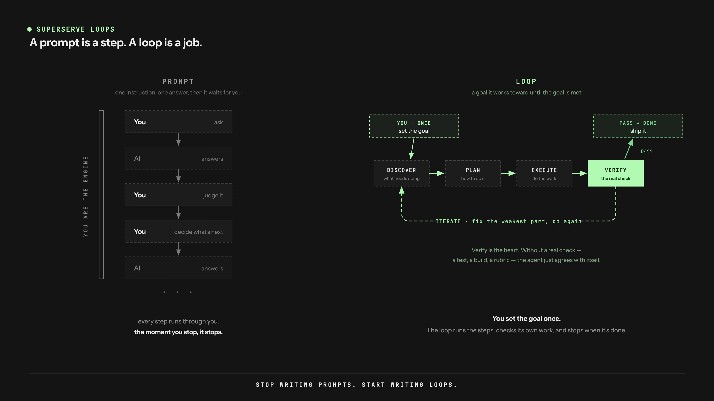
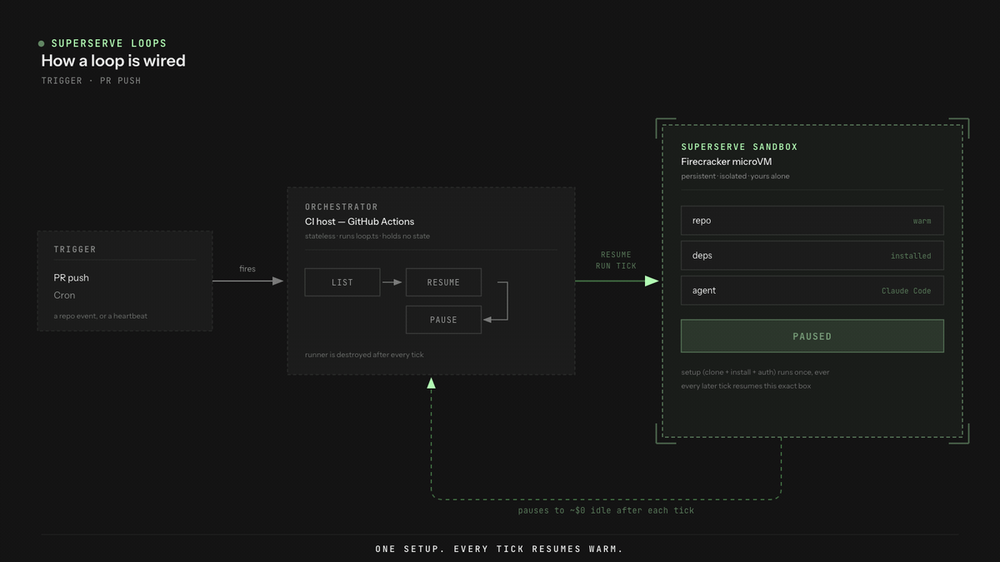

# Superserve Loops

Agent **loops** that run on Superserve sandboxes — a warm, isolated runtime for
[loop engineering](https://cobusgreyling.substack.com/p/loop-engineering).

> **Loop Engineering named the loop. Superserve is the runtime it was missing.**
>
> A loop needs memory that outlives a single run, and somewhere safe to run the code its agent
> writes. CI runners re-clone, re-install, and forget everything every tick — and you don't want an
> unattended agent running untrusted code on your own host. A Superserve sandbox is a durable,
> isolated spine: **bootstrap once**, then every tick `resume()`s warm (repo, deps, the agent
> harness all still there), runs the work inside a Firecracker microVM, and `pause()`s for ~$0 idle.



## How a loop is wired

Three roles, **only one is a sandbox**:



- **Trigger** — a repo event or a cron (the shipped PR Superloop workflow is **event-driven**:
  GitHub Actions `pull_request`, so it runs on every PR code change — no idle cron).
- **Orchestrator** (`loop.ts`) — a stateless script using [`@superserve/sdk`](../../packages/sdk).
  It finds the loop's box by `metadata`, runs one tick inside, pauses. Holds no state.
- **Worker sandbox** — boots from the `superserve/claude-code` template, so **Claude Code** is the
  brain. Skills, sub-agents, git worktrees, and memory all live _in the box_.

The reusable spine is [`lib/run-loop.ts`](./lib/run-loop.ts): `setup` (clone + install + auth) runs
**once** on first create; every later tick resumes warm and runs `iterate` only.

## Loops

| Loop                             | What it does                                                                                                                                  | Cadence    |
| -------------------------------- | --------------------------------------------------------------------------------------------------------------------------------------------- | ---------- |
| [`pr-superloop`](./pr-superloop) | Shepherd open PRs: review each new commit, run the project's checks, post one signed review, escalate risky PRs to a human. **Never merges.** | on PR push |

## Auth — headless Claude subscription

The box runs Claude Code on your **Claude subscription** (Pro/Max/Team/Enterprise), not metered API:

```bash
claude setup-token   # one-time, on a machine with a browser → prints a ~1-year OAuth token
```

Store that token as a **Superserve secret** so it's swapped in at egress and never enters the box.
Each loop binds it as `CLAUDE_CODE_OAUTH_TOKEN`. See the per-loop README for the exact steps. (You
can also use a metered `ANTHROPIC_API_KEY`, or Bedrock/Vertex — the loop code doesn't care which.)

> **Two cost meters, don't conflate them:** pausing the sandbox makes _sandbox compute_ ~$0, but
> the _LLM tokens_ are a separate bill. Keep most ticks cheap with early-exit and a smaller model.

## Run

```bash
# from the repo root
bun install
bun run examples/loops/pr-superloop/loop.ts --repo owner/name --dry-run   # no keys needed
bun run examples/loops/pr-superloop/loop.ts --repo owner/name             # one live tick
```

Unit tests use an in-memory fake sandbox (no credentials, no network):

```bash
bunx turbo run test --filter=@superserve/loops
```

> Using this outside the monorepo? Change `@superserve/sdk` in `package.json` from `workspace:*` to
> a published version.
